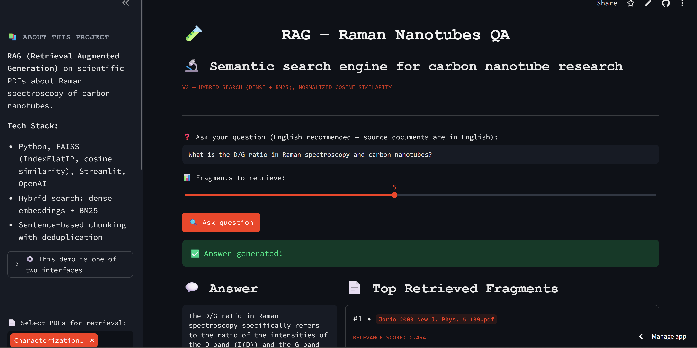

# SEM nanostructure classifier: how much of the accuracy is real?

A classifier for scanning-electron-microscopy (SEM) images of nanostructures, built to answer one question: **how much of the reported accuracy comes from near-duplicate leakage and from shortcuts such as the instrument info bar, and what does a leakage-free evaluation look like?**

Everything here follows a written specification ([`SPEC.md`](SPEC.md)) that was fixed before the code, including the rules for the test split. Every number below comes from a logged run in `reports/`.

## Short answer

| Question | Result (test split, 3 seeds unless stated) |
|---|---|
| Does a random split overstate accuracy? | Slightly. ConvNeXt-Tiny macro-F1 is 0.968 on a random split and 0.956 on a group-aware split (gap +1.3 pp); ResNet-50 0.957 vs 0.944 (+1.3 pp). All 95% intervals of the gap include zero or touch it, so the gap is **not established** at that level, but it has the same sign in both backbones. |
| Where does leakage show up? | In the random split 23.4% of the test images have a near-duplicate "cluster-mate" in the training set. The models classify those at 99.6-99.9% accuracy and the rest at 96.4-97.2%. The second number matches the group-aware result. |
| Does the model read the info bar? | The bar is **not necessary** for accuracy: removing the bottom 18.75% of every image costs 1.4 pp macro-F1 (interval +0.4 to +2.3) and 0.45 pp accuracy on test, while removing the same amount from the top costs nothing (-0.03 pp). The validation split showed no drop (+0.2 pp), the effect depends mainly on one seed pair and sits in the small classes. I read this as "no evidence of a shortcut that carries the classification; a contribution of about 1-1.5 pp in small classes cannot be excluded". |
| Is the confidence usable? | After temperature scaling (T = 3.3) the test ECE falls from 0.024 to 0.006 (ConvNeXt-Tiny). Abstaining below a threshold chosen on validation keeps 94% of the test images at 99.2% accuracy (overall 97.2%) and catches about 71% of the errors. |



## Data

NFFA-EUROPE "100% SEM Dataset" (Aversa et al., *Scientific Data* 2018; DOI 10.23728/b2share.80df8606fcdb4b2bae1656f0dc6db8ba, licence CC BY). 21,169 JPEG images in 10 classes; 332 exact duplicate copies were removed, leaving 20,837. Classes are very imbalanced (31.7x): the smallest have 22 (Fibres), 26 (Porous_Sponge) and 45 (Films_Coated_Surface) test images, so their numbers are noisy. Raw data is not in the repository; checksums of the archives are in `checksums/`.

Images were resized once to 512 x 384 and cached.

## Method

- **Splits** (70/15/15, seed 42): random stratified (E1) and group-aware (E2). Groups are connected components of cosine similarity >= 0.94 between frozen ImageNet ResNet-50 features, whole clusters go to one split. Thresholds 0.90 and 0.98 are a sensitivity check. A test asserts that no cluster crosses splits.
- **Models:** ConvNeXt-Tiny and ResNet-50 (ImageNet weights), full fine-tuning, one fixed configuration for all runs, no tuning (AdamW, 12 epochs, light augmentation, epoch chosen on validation macro-F1), 3 seeds each.
- **Test rule:** each checkpoint is evaluated on the test split exactly once, after the configuration was frozen in `SPEC.md`; nothing was changed after seeing test results. E3 and E4 are analyses fixed in `SPEC.md` before they were computed. E4 is post-hoc on the stored test logits, with all parameters fitted on validation only.
- **Intervals:** bootstrap, over images and over whole clusters. They cover the evaluation sample, **not** the variation between trainings.

## Results in more detail

Test split, mean of 3 seeds (`reports/results/test.md`):

| split | backbone | macro-F1 | 95% CI (clusters) | accuracy | ECE |
|---|---|---|---|---|---|
| random | ConvNeXt-Tiny | 0.968 | [0.958, 0.977] | 0.978 | 0.019 |
| random | ResNet-50 | 0.957 | [0.945, 0.967] | 0.972 | 0.019 |
| group-aware (0.94) | ConvNeXt-Tiny | 0.956 | [0.939, 0.966] | 0.972 | 0.024 |
| group-aware (0.94) | ResNet-50 | 0.944 | [0.924, 0.957] | 0.965 | 0.024 |

The weakest classes are Films_Coated_Surface (recall 0.84, confused with Particles and Nanowires) and Porous_Sponge (0.89), both with fewer than 50 test images. ConvNeXt-Tiny is ahead of ResNet-50 in every comparison, but this was not tested formally.

**E3, info bar** (`reports/e3/`; ConvNeXt-Tiny, group split): macro-F1 on test with the bar 0.956, without the bottom zone 0.942, without the same amount from the top 0.956. A strip of only 72 rows already gives about 0.88-0.89, so "the bar region carries class information" is true of any equally large strip and shows no special role of the bar. Limits: the test shows necessity, not use; dark bars cannot be separated from dark image content with row statistics.

**E4, calibration and abstention** (`reports/e4/`): temperature T = 3.26 (ConvNeXt-Tiny), 2.23 (ResNet-50); test ECE 0.024 -> 0.006 and 0.024 -> 0.009. The model abstains mostly on rare classes: 44% of Porous_Sponge, 37% of Films_Coated_Surface and 24% of Fibres versus 2-6% of the six largest classes (Powder: 13%).

## Demo

Live: <https://sem-nanostructure-classifier.streamlit.app/> (Streamlit Community Cloud; a sleeping app wakes up on the first visit and downloads the weights again, which takes a moment). Locally:

```
pip install -r requirements.txt
streamlit run app/streamlit_app.py
```

The weights ([Hugging Face](https://huggingface.co/slastrzelec/sem-nanostructure-classifier-convnext-tiny), model card in [`MODEL_CARD.md`](MODEL_CARD.md)) are downloaded on the first start into `data/models/` over HTTPS and checked against the sha256 recorded in the code, before and again after saving; a mismatch means the model is not loaded. A file placed there by hand (or set with `SEM_CHECKPOINT`) is used as is, with the same check. `requirements.txt` installs CPU-only torch. It shows the top-3 classes with calibrated probability, an "uncertain" flag below confidence 0.915 and an illustrative Grad-CAM. Uploads (PNG/JPEG, at most 10 MB) are processed in memory only; nothing is stored or logged.

## Reproduce

Raw data and the 512 x 384 cache are not in the repository. The pipeline, in the order it was run: `scripts/e0_extract.py` and `e0_report.py` (audit), `make_cache.py` (cache), `kaggle_embed.py` (frozen embeddings), `make_splits.py` (`grid`, then `split`), `kaggle_run.py` (training; run on free Kaggle GPUs), `kaggle_final_eval.py` (one-time test evaluation), `report_runs.py`, `e3_report.py`, `e4_report.py` (tables). Training and test evaluation ran in Kaggle notebooks that call these scripts; the notebooks themselves are not included. Development: `pip install -e .[dev]`, then `ruff check .` and `python -m pytest` (torch-dependent tests are skipped without torch; CI runs both on every push).

## Limitations

- One lab, one dataset, no external test set. The group definition (embedding similarity >= 0.94) is a proxy for "same sample", not a ground truth.
- The E1-E2 gap compares different test images, so it mixes leakage with differences between the two test samples; the within-E1 comparison (images with and without a cluster-mate in train) is descriptive, not causal.
- Confidence intervals do not include variation between trainings; with 3 seeds, differences of about 1 pp (E1 vs E2, E3) are at the noise level of single runs.
- Small classes (22-46 test images): per-class numbers move by several points with one image.
- Labels overlap conceptually (e.g. Powder vs Particles); label noise is not measured.
- **A bug that was found and fixed before any test evaluation:** the first group-aware split put almost all large clusters into validation and test (train had no cluster larger than 4 images), which made val and test unrepresentative. It was noticed from the validation loss, the split was corrected and all group-aware runs were repeated; the details are in `SPEC.md`, section 11.
- E4 (calibration, abstention) was computed after the test logits were known; all its parameters were fitted on validation and fixed in the spec before computing. Two ablations listed in the original plan, class weights and stronger augmentation, were **not run** (see `SPEC.md`).
- The demo has no out-of-distribution detector: any image, including a photograph, gets one of the 10 SEM classes.

## Licence and citation

Code: MIT (see `LICENSE`). Data: CC BY, cite Aversa, Modarres, Cozzini, Ciancio, Scientific Data 5, 180172 (2018), and the B2SHARE record above. The 20 example images in `app/samples/` are taken from that dataset (validation split).
